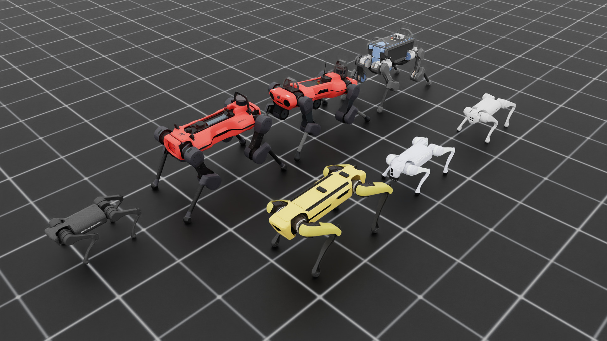
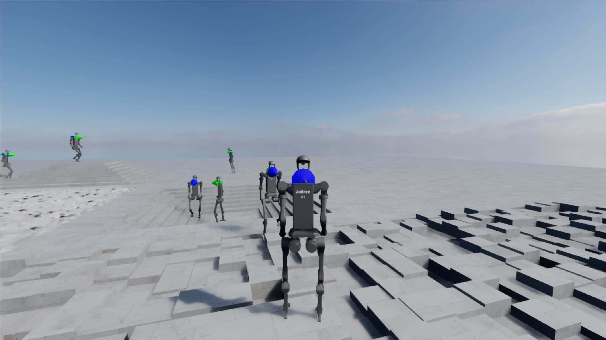

### system requirements

[](https://developer.nvidia.com/isaac-sim)
[](https://www.python.org/downloads/release/python-31013/)
[](https://releases.ubuntu.com/20.04/)
[](https://www.microsoft.com/en-ca/windows/windows-11)

```bash
# Official compatibility Checker
bash scripts/compatibility_check.sh
```

> [!Note]
> GUI checker -> [Isaac Sim Compatibility Checker](https://docs.isaacsim.omniverse.nvidia.com/5.0.0/installation/requirements.html#id6)


```bash
sudo apt install cmake build-essential
```

### Clone

```bash
git clone --recurse-submodules git@github.com:AtticusZeller/IsaacLab-uv.git
```

### install from `pyproject.toml`

```bash
uv sync --dev
```

```bash
# install all Rl frameworks
uv sync --dev --all-extras
```

### install manually

#### install isaacsim

```bash
# isaacsim 
uv add "isaacsim[all,extscache]==5.0.0"
```

#### install isaaclab

```bash
# clone
git submodule add https://github.com/isaac-sim/IsaacLab.git isaaclab

# install packages
find -L ./isaaclab/source -mindepth 1 -maxdepth 1 -type d -exec bash -c 'if [ -f "$1/setup.py" ]; then echo "Installing: $1"; uv add --editable "$1"; fi' _ {} \;

# install the learning frameworks specified
uv add --editable "./isaaclab/source/isaaclab_rl[all]"  --optional rl
uv add --editable "./isaaclab/source/isaaclab_mimic[all]" --optional rl
```

### Test 

#### test `isaac sim`

```bash
isaacsim
```

headless for GPU server

```bash
isaacsim --no-window
```

#### test `isaaclab`


### disable IOMMU

* Editing your GRUB configuration file:

```bash
sudo nano /etc/default/grub
```

* Adding iommu=off or intel_iommu=off (for Intel systems) or amd_iommu=off (for AMD systems) to the GRUB_CMDLINE_LINUX_DEFAULT line.

* Updating GRUB and rebooting:

```bash
sudo update-grub
sudo reboot
```

> [!Note]
> Disabling IOMMU may improve performance for applications like Isaac Sim but could reduce system security and break certain virtualization features. Consider your specific requirements before making this change.

## [Demos](https://isaac-sim.github.io/IsaacLab/main/source/overview/showroom.html)

> [!Note]
> it takes a while to load the first time you run it.

### quadrupeds



```bash
python  isaaclab/scripts/demos/quadrupeds.py
```

### unitree H1



```bash
python isaaclab/scripts/demos/h1_locomotion.py
```
